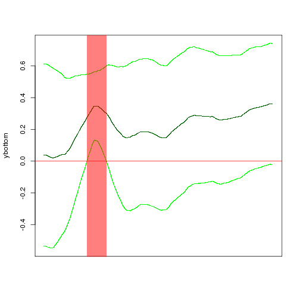
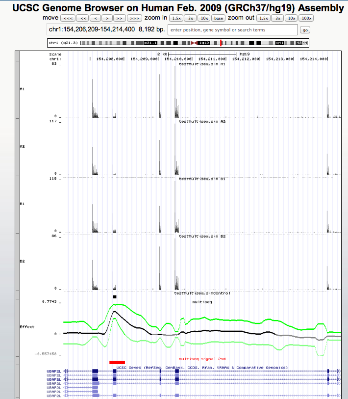

<!--
%\VignetteEngine{knitr}
%\VignetteIndexEntry{An Introduction to the multiseq package}
-->


An Introduction to **multiseq** package
=======================================


The **multiseq** package is an **R** package for multiscale sequence analysis and is ongoing work in the [Stephens lab](http://stephenslab.uchicago.edu) at the University of Chicago. *Multiseq* has two main modes of operation: smoothing and effect estimation....


In this vignette you will learn how to install the package, run *multiseq* in its two different modes of operation, and visualize its output (and input data) either in **R** or in the [UCSC Genome Browser](https://genome.ucsc.edu/) as a [Track Hub](http://www.genome.ucsc.edu/goldenPath/help/hgTrackHubHelp.html).


Downloading and installing the package
--------------------------------------

To download the **multiseq** package from its [github repository](https://github.com/stephenslab/multiseq) click [here](https://github.com/stephenslab/multiseq/blob/master/package/multiseq.tar.gz?raw=true). 


**Multiseq** depends on **ashr**, a package in development that you can download and install following instructions [here](https://github.com/stephens999/ash/blob/master/README). It also depends on [**Rcpp**](http://cran.r-project.org/web/packages/Rcpp/index.html), and therefore it requires an **R** version higher or equal to **3.0.0**. To install the package, install **ashr** and then type the following commands in R:

```
    install.packages("tools")
    biocLite("rhdf5")
    install.packages("data.table")
    install.packages("Rcpp")
    install.packages("path/to/multiseq.tar.gz",repos=NULL,type="source")
```
where you should replace "path/to/multiseq.tar.gz" with the path to the downloaded multiseq package. 


Some optional steps (only working in UNIX/LINUX) are needed if you want to use **multiseq** on sequencing data in *hdf5*, *bam*, *bigWig*, or *bigBed* format or if you want to visualize input/output sequencing data in the UCSC Genome Browser, i.e., if you want to run functions `get.counts`, `samplesheetToTrackHub`, and `multiseqToTrackHub`.

### Optional steps to:

#### Read data in *hdf5*, *bam*, or *bigWig* format

Function `get.counts` converts *hdf5*, *bam*, *bigWig*, and *bigBed* input files into R objects that can then be used as input to the main `multiseq` function. In order to use `get.counts`, make sure you have `awk`, `samtools`, `wigToBigWig`, and `bigWigToWig` in your path (the last two are UCSC tools). 


If */data/tools/ucsctools/* is your path to the UCSC tools and */usr/local/bin/* is your path to `samtools` then add the following lines to your *~/.bashrc* file:

    export PATH=$PATH":/data/tools/ucsctools/:/usr/local/bin/"

#### Visualize results in the UCSC Genome Browser

Functions `samplesheetToTrackHub` and `multiseqToTrackHub` display `multiseq` input and output in the UCSC Genome Browser. In order to use them, you need a folder that is accessible via the Internet. If */some/path* is the path to a folder that is accessible via the Internet - the "mountpoint" - and *https:some/address* is the http address of the mountpoint, you need to set the following shell environmental variables by adding the following lines to your *~/.bashrc*:

    # the following lines specify the mountpoint and the http address associated with the mountpoint
    export MOUNTPOINT_PATH="/some/path"
    export MOUNTPOINT_HTTP_ADDRESS="https:some/address"


#### Notes

After adding new lines to your *.bashrc* for the first time, remember to either login again, or do 
    
```
    source ~/.bashrc 
```

Remember that when you submit jobs to a compute cluster (e.g. using SGE's qsub), they run in "batch mode" and may not execute your *~/.bashrc*. To ensure that your jobs have the correct environmental variables set, you should be able to pass a flag to your cluster submission command (e.g. the `-V` flag to `qsub`).


For PPS cluster users in the stephenslab group: replace */some/path* with */data/internal/solexa_mountpoint/$USER* where *$USER* is your username in the cluster; the http address associated to this mountpoint is password protected (ask John or Ester).]

Now we can load the package


```r
    #load the package
    library(ashr)
    library(multiseq)
    library(tools)      # this is necessary to do RmdToHtml
    library(data.table) # this is necessary to do RmdToHtml
```

Running `multiseq`
-----------------

In this section you will learn how to use `multiseq` to smooth a signal and to estimate an effect given a covariate `g`.

First load the R object containing example data.


```r
    #load example data - R object
    data(OAS1,package="multiseq")    #change this into a small interval from the simulated data...
    x <- OAS1$M
    g <- OAS1$g
    read.depth <- OAS1$read.depth
```

Then select the first signal and apply `multiseq` without providing a covariate `g` to only perform smoothing of the signal.


```r
    #smoothing
    res0         <- multiseq(x=x[g==0,], minobs=1, lm.approx=FALSE, read.depth=read.depth[g==0])
    #plot baseline mean value +- 2 posterior standard deviations
    fra          <- 2 #s.d.
    #plotResults(res0, fra)
```

Now let's use a covariate `g` and estimate an effect:


```r
    #estimating an effect
    res           <- multiseq(x=x, g=g, minobs=1, lm.approx=FALSE, read.depth=read.depth)
    #find intervals where `multiseq` found a strong effect (zero is outside of +/- fra posterior standard deviations
    res$intervals <- get.effect.intervals(res, fra)
    res$intervals
```

```
## $start
## [1] 2706 3724 2691 2693 2701 3398
## 
## $end
## [1] 3389 3919 2692 2699 2703 3632
## 
## $sign
## [1] "-" "-" "-" "-" "-" "-"
## 
## $fra
## [1] 2
## 
## $type
## [1] "local"
```

```r
    #plot estimated effect mean and posterior standard deviation
    plotResults(res, fra)  #check effect
```


Function `get.effect.intervals` outputs intervals where `multiseq` found strong effect (zero is outside of +/- 2 * posterior standard deviations). Output interval is in bed format (start is 0-based, end is 1-based).

Finally you can use `write.effect.mean.variance.gz` to save results.

```r
    #save results in multiseq_sim
    multiseq_folder <- "~/multiseq_sim/"
    write.effect.mean.variance.gz(res, multiseq_folder)
```

Running multiseq on sequencing data
-----------------------------------

Special tools are required to handle next generation sequencing data because of their high throughput nature. **Multiseq**'s function `get.counts` uses `samtools` or the *UCSC tools* to read data in *bam*, *bigWig*, or *hdf5* format. 

Function `get.counts` requires as input a samplesheet and a genomic region. The samplesheet should have the following format:

    SampleID Type Replicate Peaks ReadDepth bigWigPath
    A1 Control 1 peak.bb 16335812 A1.bw
    A2 Control 2 peak.bb 18197248 A2.bw
    B1 Test 1 peak.bb 24225586 B1.bw
    B2 Test 2 peak.bb 12378544 B2.bw

The following fields are required: "SampleID" containing sample IDs, "ReadDepth" specifying sequencing depth for each sample, "bigWigPath" and/or "h5FullPath" and/or "bamReads" specifying the path to countdata files in *bam*, *bigWig*, or *hdf5* format, respectively. Field "Peaks" is not required but can be used to specify the path to a *bigBed* file (e.g., the path to bed file with ChipSeq peaks).
  

```r
    # samplesheet samplesheet.sim.txt contains paths relative to the package directory 
    # so to use it, we need to change the working directory: 
    setwd(file.path(path.package("multiseq"),"extdata","sim"))
    samplesheet <- file.path(path.package("multiseq"),"extdata","sim","samplesheet.sim.txt")
    region      <- "chr1:87297710-87305901"
    samples     <- read.table(samplesheet, stringsAsFactors=F, header=T)
    x           <- get.counts(samples, region)
```

```
## [1] "Loading A1.bw"
## [1] "bigWigToWig A1.bw -chrom=chr1 -start=87297710 -end=87305901 stdout | grep -v fixed > /tmp/RtmpsIWm7S/file7d403e58da5d.wig"
## [1] "Loading A2.bw"
## [1] "bigWigToWig A2.bw -chrom=chr1 -start=87297710 -end=87305901 stdout | grep -v fixed > /tmp/RtmpsIWm7S/file7d408396f16.wig"
## [1] "Loading B1.bw"
## [1] "bigWigToWig B1.bw -chrom=chr1 -start=87297710 -end=87305901 stdout | grep -v fixed > /tmp/RtmpsIWm7S/file7d405cd7d601.wig"
## [1] "Loading B2.bw"
## [1] "bigWigToWig B2.bw -chrom=chr1 -start=87297710 -end=87305901 stdout | grep -v fixed > /tmp/RtmpsIWm7S/file7d4045aa7b9b.wig"
```

```r
    #alternatively:
    #samples    <- read.table(samplesheet, stringsAsFactors=F, header=T)
    g           <- factor(samples$Tissue)
    g           <- match(g, levels(g))-1
```

### Smoothing using `multiseq`


```r
    res0        <- multiseq(x=x[g==0,], minobs=1, lm.approx=FALSE, read.depth=samples$ReadDepth[g==0])
    #plot estimated mean value +- 2 s.d.
    fra         <- 2 #s.d.
    #plotResults(res0, fra)
```


### Finding an effect using `multiseq`


```r
    res           <- multiseq(x=x, g=g, minobs=1, lm.approx=FALSE, read.depth=samples$ReadDepth)
    res$intervals <- get.effect.intervals(res, fra, region)
    #plot estimated effect and s.d. and print intervals where there is an effect
    plotResults(res, fra)  #check effect
```



```r
    #save results in multiseq_sim
    multiseq_folder <- "~/multiseq_sim/chr1.87297710.87305901/"
    #?write.effect.mean.variance.gz
    write.effect.mean.variance.gz(res, multiseq_folder)
    #?write.effect.intervals    
    write.effect.intervals(res, multiseq_folder, fra)
```

### Visualizing input data using `samplesheetToTrackHub`


With function `samplesheetToTrackHub` you can create a [Track Hub](http://www.genome.ucsc.edu/goldenPath/help/hgTrackHubHelp.html) and visualize your input data in the [UCSC Genome Browser](https://genome.ucsc.edu/). Before you use this function, follow installation instructions in the "Optional steps" paragraph above.


```r
    hub_name <- "testMultiseq/sim"
    samplesheetToTrackHub(samplesheet, hub_name)
```

Function `samplesheetToTrackHub` will create a Track Hub in folder */some/path/testMultiseq/sim/* and will print the following message:

    go to http://genome.ucsc.edu/cgi-bin/hgHubConnect and click on the My Hubs window    
    copy paste the following string in the URL field
    https:some/address/testMultiseq/sim/hub.txt
    submit center the genome browser on the region of interest
    if the track is hidden click on show and then refresh

If the read tracks or the bed files are large, make sure enough memory is available to run `simulationToTrackHub` (e.g., use ql 10g on the PPS cluster).

This is a screenshot of the Track Hub in the Genome Browser:



Visualizing output data using `multiseqToTrackHub`
--------------------------------------------------------------------------------------


After running multiseq and saving results using `write.effect.mean.variance.gz` and `write.effect.intervals` (see above), you can create a Track Hub of results using function `multiseqToTrackHub`. `multiseqToTrackHub` will create a Track Hub that can be visualized in the UCSC Genome Browser to display
- the effect +- 2 standard errors
- the significant intervals at 2 sd.

Function `multiseqToTrackHub` requires two arguments: the multiseq output folder *multiseq_folder* and the path to a file with chromosome names and lengths *chrom_file*:


```r
    region          <- "chr1:87297710-87305901"
    hub_name        <- "testMultiseq/multiseq_sim"
    multiseq_folder <- "~/multiseq_sim/" 
    chrom_file      <- file.path(path.package("multiseq"),"extdata","chromosome.lengths.hg19.txt")
    multiseqToTrackHub(region, hub_name, multiseq_folder, chrom_file)
```

Function `multiseqToTrackHub` will create a Track Hub named *multiseq_sim* in the *https:some/address/testMultiseq/* folder and will print the following message:
  
    go to http://genome.ucsc.edu/cgi-bin/hgHubConnect and click on the My Hubs window
    copy paste the following string in the URL field
    https:some/address/testMultiseq/multiseq_sim/hub.txt
    submit and center your genome browser around chr1:87297710-87305901 and make track visible

This is a screenshot of the Track Hub in the Genome Browser:


Something interesting from a different R package
------------------------------------------------
$$latex
a_i = 
\begin{cases}
			\tan (e_{i2}/e_{i1}), & \text{if $e_{i1}>0$;}
			     		       \newline
							\tan (e_{i2}/e_{i1}) + \pi, & \text{otherwise.}
\end{cases}						     		     
$$ 

where $e_1$ and $e_2$ are the largest two eigenvalues of the correlation  matrix. See [Michael Friendly (2002)](www.datavis.ca/papers/corrgram.pdf) for details.

* `"FPC"` for the first principal component order.

* `"hclust"` for hierarchical clustering order, and `"hclust.method"` for the agglomeration method to be used . `"hclust.method"` should be one of `"ward"`, `"single"`, `"complete"`, `"average"`, `"mcquitty"`, `"median"` or `"centroid"`.

* `"alphabet"` for alphabetical order.


Here is an animation to show the relation between significant level and confidence interval.

```r
#for(i in seq(0.1, 0, -0.005)){
#  tmp <- cor.mtest(mtcars,1-i)
#  corrplot(M, p.mat = tmp[[1]], low=tmp[[2]], upp=tmp[[3]], order="hclust",
#  	      pch.col="red", sig.level = i, plotC="rect", cl.pos="n",
#	      		     mar=c(0,0,1,0), 
#			     		     title=substitute(alpha == x,list(x=format(i,digits=3,nsmall=3))))
#}
```

<div align = "center">
 <embed width="504" height="504" name="plugin" src="http://animation.r-forge.r-project.org/swf/corrplot-ani.swf" type="application/x-shockwave-flash"> 
</div>

