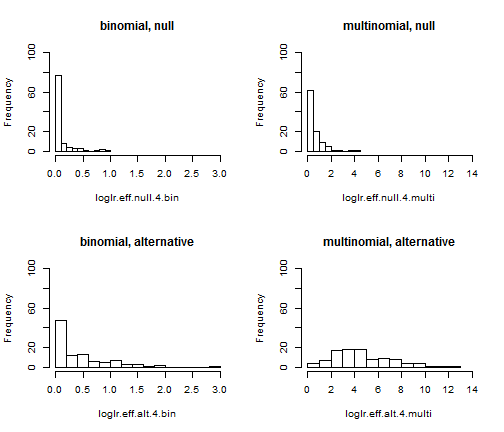

Look at a sample loglr comparison between binomial vs multinomial simulations


```r
load("loglr_binmulti.Robj")
```


You can also embed plots, for example:


```r
par(mfcol = c(2, 2))
hist(loglr.eff.null.4.bin, main = "binomial, null", xlim = c(0, 3), ylim = c(0, 
    100), breaks = 10)
hist(loglr.eff.alt.4.bin, main = "binomial, alternative", xlim = c(0, 3), ylim = c(0, 
    100), breaks = 20)
hist(loglr.eff.null.4.multi, main = "multinomial, null", xlim = c(0, 14), ylim = c(0, 
    100), breaks = 10)
hist(loglr.eff.alt.4.multi, main = "multinomial, alternative", xlim = c(0, 14), 
    ylim = c(0, 100), breaks = 10)
```

 


```r
sort(loglr.eff.null.4.bin)
```

```
##   [1] 0.0000000 0.0000000 0.0000000 0.0000000 0.0000000 0.0000000 0.0000000
##   [8] 0.0000000 0.0000000 0.0000000 0.0000000 0.0000000 0.0000000 0.0000000
##  [15] 0.0000000 0.0000000 0.0000000 0.0000000 0.0000000 0.0000000 0.0000000
##  [22] 0.0000000 0.0000000 0.0000000 0.0000000 0.0000000 0.0000000 0.0000000
##  [29] 0.0000000 0.0000000 0.0000000 0.0000000 0.0000000 0.0000000 0.0000000
##  [36] 0.0000000 0.0000000 0.0000000 0.0000000 0.0000000 0.0000000 0.0000000
##  [43] 0.0000000 0.0000000 0.0000000 0.0000000 0.0000000 0.0000000 0.0000000
##  [50] 0.0000000 0.0000000 0.0000000 0.0003568 0.0004320 0.0012774 0.0017372
##  [57] 0.0030504 0.0045558 0.0066034 0.0094026 0.0111119 0.0114171 0.0130348
##  [64] 0.0132277 0.0134053 0.0186433 0.0254969 0.0295364 0.0338328 0.0347846
##  [71] 0.0396586 0.0512756 0.0551385 0.0667994 0.0700240 0.0710144 0.0804613
##  [78] 0.1008930 0.1173044 0.1295194 0.1332757 0.1341711 0.1351388 0.1585738
##  [85] 0.1705439 0.2088799 0.2194465 0.2213205 0.2595632 0.3743400 0.3763176
##  [92] 0.3976291 0.4050142 0.4078326 0.4626284 0.5731489 0.7262034 0.8694626
##  [99] 0.8892467 0.9555101
```

```r
sort(loglr.eff.alt.4.bin)
```

```
##   [1] 0.0000000 0.0000000 0.0000000 0.0000000 0.0000000 0.0000000 0.0000000
##   [8] 0.0000000 0.0005398 0.0009788 0.0010318 0.0010764 0.0023494 0.0025155
##  [15] 0.0035199 0.0043866 0.0257454 0.0325965 0.0330251 0.0346575 0.0382355
##  [22] 0.0387650 0.0500613 0.0620091 0.0636093 0.0643354 0.0675819 0.0752609
##  [29] 0.0784041 0.0853511 0.0878768 0.0977915 0.0983727 0.1065821 0.1117914
##  [36] 0.1295819 0.1328672 0.1353402 0.1572578 0.1577052 0.1615078 0.1640562
##  [43] 0.1661069 0.1734875 0.1850989 0.1986462 0.1990115 0.2393648 0.2402516
##  [50] 0.2522716 0.2593937 0.2872219 0.2899303 0.3087714 0.3353598 0.3550386
##  [57] 0.3654544 0.3829030 0.3899620 0.4041223 0.4098756 0.4334292 0.4404174
##  [64] 0.4477192 0.4538603 0.4561717 0.4845407 0.4906328 0.4925706 0.4968793
##  [71] 0.5025749 0.5101454 0.6020337 0.6765549 0.6882337 0.6890843 0.6942861
##  [78] 0.7071428 0.8233128 0.8285980 0.9152412 0.9609026 0.9915345 1.0095510
##  [85] 1.0274228 1.0782155 1.0990781 1.1022527 1.1343891 1.1437818 1.2813695
##  [92] 1.3285125 1.3960991 1.4013139 1.5669139 1.5919410 1.7533986 1.8612402
##  [99] 1.9211396 2.8176988
```

```r
sort(loglr.eff.null.4.multi)
```

```
##   [1] 0.0000000 0.0000000 0.0000000 0.0000000 0.0004733 0.0022308 0.0051874
##   [8] 0.0105688 0.0157954 0.0165238 0.0307144 0.0401905 0.0412710 0.0471027
##  [15] 0.0473484 0.0503362 0.0580969 0.0669600 0.0734467 0.0841750 0.0882699
##  [22] 0.0927650 0.0933542 0.0980097 0.0999847 0.1082765 0.1158612 0.1192918
##  [29] 0.1354147 0.1417308 0.1540704 0.1687946 0.1702470 0.1872484 0.2133194
##  [36] 0.2168316 0.2216645 0.2281663 0.2470680 0.2523110 0.2677202 0.2714523
##  [43] 0.2855782 0.2859934 0.3061882 0.3256488 0.3305934 0.3347877 0.3488970
##  [50] 0.3547601 0.3744273 0.3919847 0.4003593 0.4120790 0.4132490 0.4226800
##  [57] 0.4470323 0.4596094 0.4607534 0.4736239 0.4764610 0.4831904 0.5026710
##  [64] 0.5113962 0.5128397 0.5137550 0.5145388 0.5256581 0.5345988 0.5616521
##  [71] 0.5993679 0.6326696 0.6444807 0.6655648 0.6693641 0.6799282 0.7105591
##  [78] 0.7163291 0.7631706 0.8117960 0.9895268 0.9989817 1.0086672 1.0105109
##  [85] 1.0558908 1.0738330 1.0776899 1.1633292 1.2118329 1.2947710 1.3511706
##  [92] 1.6053454 1.6720478 1.6939162 1.8285544 1.9540828 2.4284051 2.5877650
##  [99] 3.6088160 4.3148303
```

```r
sort(loglr.eff.alt.4.multi)
```

```
##   [1]  0.2971  0.5584  0.7350  0.8674  1.2853  1.5030  1.5087  1.6110
##   [9]  1.6323  1.8294  1.8815  2.0007  2.2623  2.4314  2.4392  2.4693
##  [17]  2.4794  2.5055  2.5165  2.5181  2.5744  2.6416  2.6930  2.8410
##  [25]  2.9185  2.9590  2.9620  2.9740  3.0879  3.1955  3.2055  3.2589
##  [33]  3.2648  3.2986  3.4120  3.5513  3.5948  3.6291  3.6722  3.7525
##  [41]  3.7809  3.7991  3.8018  3.9240  3.9652  3.9654  4.0011  4.0691
##  [49]  4.1438  4.1627  4.1812  4.2164  4.2310  4.2401  4.2442  4.5388
##  [57]  4.6545  4.6639  4.6745  4.7929  4.8319  4.8621  4.8762  4.8975
##  [65]  5.0770  5.1323  5.4495  5.4521  5.6653  5.7252  5.7626  5.9303
##  [73]  6.0963  6.3112  6.3352  6.3358  6.4127  6.5875  6.6294  6.6543
##  [81]  6.7601  7.2033  7.3088  7.3607  7.3618  7.4718  7.5232  7.6212
##  [89]  7.7900  8.2627  8.3926  8.5397  8.8035  9.2721  9.5689  9.6575
##  [97]  9.9262 10.2962 11.2309 12.2688
```

```r

summary(loglr.eff.null.4.bin)
```

```
##    Min. 1st Qu.  Median    Mean 3rd Qu.    Max. 
##  0.0000  0.0000  0.0000  0.0909  0.0703  0.9560
```

```r
summary(loglr.eff.alt.4.bin)
```

```
##    Min. 1st Qu.  Median    Mean 3rd Qu.    Max. 
##  0.0000  0.0642  0.2560  0.4600  0.6880  2.8200
```

```r
summary(loglr.eff.null.4.multi)
```

```
##    Min. 1st Qu.  Median    Mean 3rd Qu.    Max. 
##   0.000   0.106   0.365   0.571   0.672   4.310
```

```r
summary(loglr.eff.alt.4.multi)
```

```
##    Min. 1st Qu.  Median    Mean 3rd Qu.    Max. 
##   0.297   2.950   4.170   4.710   6.340  12.300
```


